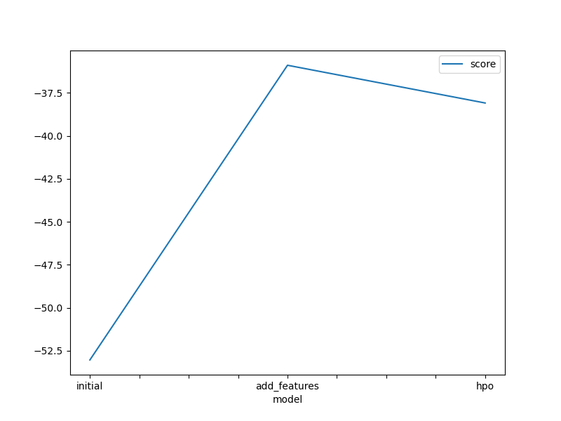
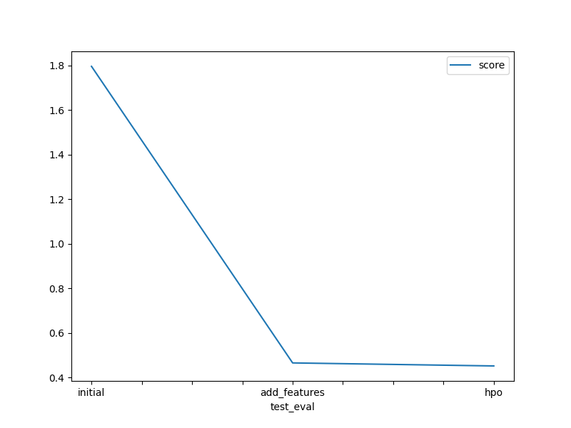

# Report: Predict Bike Sharing Demand with AutoGluon Solution
## Yeman Brhane Hagos

## Initial Training
### What did you realize when you tried to submit your predictions? What changes were needed to the output of the predictor to submit your results?
- The model output was floating point, and it needed to be converted to an integer
- The model output should be also greater than zero (as it was suggested in the template notebook), but the values generated by the model were greater than zero for all entries.

### What was the top ranked model that performed?
- The best model was **WeightedEnsemble_L3**
- Ensemble models combine the strength of weak learners and thus, have better generalisability

## Exploratory data analysis and feature creation
### What did the exploratory analysis find and how did you add additional features?
- Using EDA, the features had different ranges, thus standardisation was applied to non-categorical features and one-hot-encoding was applied to categorical features
- The date time feature was also split into year, month, day and hour and each of them was added as a feature column.
- The 'season' and 'weather' feature one-hot-encoded

### How much better did your model preform after adding additional features and why do you think that is?
- Adding year, month, day and hour features improved the score from 1.79587 to 0.47026.
- Splitting the year, month, day and hour features allows the model to capture various patterns with varying duration. For example, year will capture long-term patterns and month will capture seasonal patterns, while day and hour will capture the pattern at day and hourly levels since the bike usage could vary depending on the day and time. Having separate feature columns thus gives a more granular view of the time spectrum and improved model performance.
- **Beyond the minimum requirement:** standardisation of continuous features and one-hot-encoding of categorical features was applied as a pre-processing. This improved the Kaggle score from 0.47026 to 0.46593.

## Hyper parameter tuning
### How much better did your model preform after trying different hyper parameters?
- Hyperparameter tuning improved model performance from 0.46593 to 0.45236.

### If you were given more time with this dataset, where do you think you would spend more time?
- I will spend more time applying different pre-processing methods for the features and hyperparameter tuning.
      - Apply cyclic encoding of month/day/hour features instead of feature standardisation
- Implementing the metric used in the competition and using it as a custom metric during model training and tuning hyper-parameters to find the best model
- Apply a 5-cross-validation split and submit the best model or ensemble of models

### Create a table with the models you ran, the hyperparameters modified, and the kaggle score.
|model|time_limit|num_trials|num_epoch|score|
|--|--|--|--|--|
|initial|600|--|default|1.79587|
|add_features|600|--|default|0.46593|
|hpo|900|5|50|0.45236|

### Create a line plot showing the top model score for the three (or more) training runs during the project.

Figure 1: Plot comparing model score for training. The metric used was root mean square error, and the AutoGluon Tabular Predictor optimises the negative of the metric.

### Create a line plot showing the top kaggle score for the three (or more) prediction submissions during the project.

Figure 2: Plot of Kaggle scores for different submissions
## Summary
A model to forecast bike rental was implemented using AutoGluon and the results were submitted to Kaggle. To improve model performance, feature pre-processing, feature engineering following EDA and hyperparameter tuning were performed and trained different models. Feature engineering and pre-processing improved the performance of the model, and hyperparameter tuning resulted in a small improvement of the Kaggle score. Exploring more hyperparameter space and data engineering could improve the Kaggle score.
